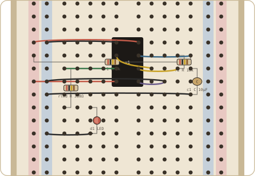

<p align="center">
  
</p>

<p align="center">
  <strong>Breadboard layouts a person can actually build.</strong><br />
  JSON in. A real solderless board out. An MCP server so an agent can place the parts.
</p>

<p align="center">
  
  
  
</p>

<p align="center">
  
</p>

<p align="center"><sub>The 555 blinker example, rendered by Crumb — same SVG the editor and CLI produce.</sub></p>

---

Crumb is a **layout tool**, not a simulator. It draws the holes, strips, and jumpers you will use at the bench. It will yell if two parts share a hole or if VCC meets GND. It will not compute LED current.

## Features

- Interactive editor in the browser (zoom, drag, undo, net highlight, short glow)
- Hole addresses a human can follow (`10-e`, `LP-12`, `u1.VCC`, `m1.pos`)
- Catalog: DIP chips, Nano / Pico / ESP32 on the board, Uno / Pi off-board, passives, switches, sensors, power
- Short detection, build steps, BOM, JSON / SVG / PNG export, share links
- Local MCP server using the same validator as the editor
- SVG CLI with no `npm install`

## Quick start

**Editor**

```bash
git clone https://github.com/anglim3/crumb.git
cd crumb
npm install
npm run dev
```

Open the Vite URL (default [http://localhost:5173](http://localhost:5173)). Pick an example, place parts, draw jumpers. Layouts autosave. A `#c=…` hash loads a shared project.

**CLI** — no install

```bash
node --experimental-strip-types scripts/crumb-svg.mjs examples/555-blinker.json blinker.svg
```

**Tests**

```bash
npm test
```

## Examples

| File | What it is |
| --- | --- |
| [`examples/555-blinker.json`](examples/555-blinker.json) | Astable 555 + LED |
| [`examples/homekit-blinds.json`](examples/homekit-blinds.json) | Nano ESP32 + TMC2208 + NEMA 17 + limit switch |
| [`src/lib/crumb/examples.ts`](src/lib/crumb/examples.ts) | Button LED, Uno + DHT22, ESP32 LED, Pico button |

The blinds bench jumpers the barrel jack (`m1.pos` / `m1.neg`) onto RP / RM (12 V) and the stepper coils onto the TMC2208 taps. LP is 3V3 from the Nano ESP32. Use catalog id `nano-esp32`, not `nano`.

## MCP

Point the harness at this repo root as `cwd`. MCP does not need `npm install`.

```json
{
  "mcpServers": {
    "crumb": {
      "command": "node",
      "args": ["--experimental-strip-types", "mcp/server.mjs"],
      "cwd": "/absolute/path/to/crumb"
    }
  }
}
```

| Tool | What it does |
| --- | --- |
| `list_parts` | Search the catalog |
| `get_board` | Read the project JSON |
| `set_project` | Replace the whole document |
| `place_part` | DIP (`anchor`), leaded (`from` / `to` / `mid` / `legs`), module (`slot`, `offsetRow`) |
| `add_wire` | Jumper between holes or `part.pin` |
| `remove_part` | Drop a part by id |
| `list_nets` | List jumper endpoints |
| `validate` | Occupancy + rail / supply / lead shorts |

Read [AGENTS.md](AGENTS.md) before an agent starts placing parts. Default file: `examples/555-blinker.json`.

## Hole language

| Address | Meaning |
| --- | --- |
| `10-e` | Row 10, column e |
| `LP-10` / `LM-10` | Left + / − rail at row 10 |
| `RP-10` / `RM-10` | Right + / − rail |
| `u1.8` or `u1.VCC` | Pin on a placed part |
| `m1.5v` / `m1.pos` | Pin on any off-board module |

Boards: `mini` (17 rows), `half` (30, split rails), `full` (63, split rails).

`a`–`e` on a row are one strip. `f`–`j` are another. The gutter isolates them. Split rails break at mid-board — jumper the two halves if you need them joined.

DIP pin 1 sits on the left strip (`a`–`e`). The body crosses the gutter.

- `esp32` is a **30-pin** DevKit, pin 1 = 3V3. Park a 38-pin DevKitC as a module.
- `nano-esp32` is ABX00083. Pin 1 is D12, not classic Nano TX.
- Leaded parts: two holes (`from` / `to`), three (`mid`), or four (`legs`).

<details>
<summary>Project file shape</summary>

```json
{
  "version": 1,
  "name": "555 blinker",
  "board": "half",
  "parts": [
    { "kind": "dip", "id": "u1", "def": "ne555", "anchor": "10-e" },
    { "kind": "leaded", "id": "r1", "def": "resistor", "from": "LP-11", "to": "11-j", "value": "1k" }
  ],
  "wires": [{ "id": "w1", "from": "u1.8", "to": "LP-10", "color": "#c45c4a" }]
}
```

Catalog ids live in [`src/lib/crumb/catalog.ts`](src/lib/crumb/catalog.ts). Keep [`mcp/catalog.json`](mcp/catalog.json) in sync when you add parts.

</details>

## Repo map

| Path | What |
| --- | --- |
| `src/lib/crumb/` | Model, nets, shorts, SVG |
| `src/components/crumb/` | Editor |
| `src/main.tsx` | Vite entry |
| `mcp/server.mjs` | MCP adapter |
| `scripts/crumb-svg.mjs` | CLI render |
| `examples/` | Known-good boards |

## Contributing

The repo is private until public release. Agent notes and geometry laws: [AGENTS.md](AGENTS.md). Change the core under `src/lib/crumb` first. Keep MCP thin.

## License

[MIT](LICENSE). Not SPICE. Not a PCB tool.
